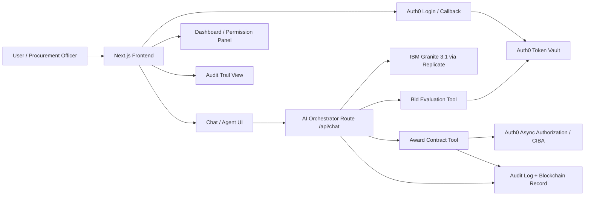

# 🛡️ Auth Ecosystem: Secure Agentic Procurement

**Authorized to Act Submission**

Auth Ecosystem is a premium, secure, and production-ready procurement platform built to demonstrate how AI agents can interact with high-stakes financial data using **Auth0 Token Vault** and **IBM Granite 3.1**.


## 🚀 Key Features

- **IBM Granite 3.1 Governance**: Utilizing the latest Granite models for technical bid evaluation and risk assessment.
- **Auth0 Token Vault Integration**: The AI agent never sees the user's raw credentials. It uses delegated access tokens with strictly scoped permissions (`read:bids`, `write:evaluations`).
- **CIBA Step-Up Authentication**: High-stakes actions (like awarding a $2.4M contract) trigger a real-time Auth0 Guardian push notification for human-in-the-loop approval.
- **Blockchain-Verified Audit Trail**: Every agentic action is logged to an immutable ledger for full transparency and compliance.
- **Premium Glassmorphism UI**: A state-of-the-art dashboard built with Next.js 15, Framer Motion, and Tailwind CSS.

## 🛠️ Technical Stack

- **Frontend**: Next.js 15 (App Router), Tailwind CSS, Framer Motion, Lucide Icons.
- **AI Orchestration**: Vercel AI SDK + `@auth0/ai-vercel` + Replicate.
- **Security**: Auth0 (OIDC), Auth0 Token Vault, Auth0 AI SDK.
- **Backend**: Node.js/Express with `jose` for JWT validation.
- **LLM**: IBM Granite 3.1 (via Replicate).

## 🏗️ System Architecture

Auth Ecosystem is organized as a layered agentic system. The frontend handles sign-in, chat, dashboard, and approval UX. The AI route orchestrates model calls and tools. Auth0 provides identity, scoped delegation, and step-up authorization. The backend owns domain APIs, audit events, and procurement data.



### Architecture Layers

1. **Presentation Layer**
   - Landing page, dashboard, and audit trail views
   - Permission visibility and approval prompts
   - Chat interface for agent interaction

2. **Identity and Authorization Layer**
   - Auth0 login with PKCE
   - Token Vault for delegated access
   - CIBA step-up for sensitive actions

3. **Agent Orchestration Layer**
   - `/api/chat` converts user prompts into AI messages
   - Granite 3.1 performs bid analysis and reasoning
   - Tool calls are governed by the system prompt

4. **Tooling Layer**
   - Bid evaluation runs with scoped read access
   - Contract award requires human approval
   - Tool output is structured for auditability

5. **Audit and Transparency Layer**
   - Permission dashboard shows active scopes
   - Step-up modal shows risk, scope, and approval window
   - Audit trail records sensitive actions and outcomes

### Core Request Flow

1. The user signs in through Auth0.
2. The frontend stores a session and loads the dashboard.
3. A chat request is sent to `/api/chat`.
4. The AI model evaluates the request and invokes tools when needed.
5. Token Vault supplies delegated access for approved scopes.
6. High-risk actions trigger CIBA step-up approval.
7. The action is written to the audit trail.

## 🔒 Security Model

The project implements a multi-layered security model:
1. **Delegation**: User logs in via Auth0 and delegates specific scopes to the Procurement Agent.
2. **Isolation**: The agent calls a backend proxy. The proxy uses the **Token Vault** to exchange the agent's context for a real downstream access token.
3. **Escalation (CIBA)**: If the agent attempts to "Award a Contract", the system detects the `contract:award` scope requires a **Step-Up**. A push notification is sent to the user's phone. Only after approval does the agent receive the final authorization to act.

### Security Enhancements Added for Submission

- **Risk-Aware Approval Panel**: The step-up modal shows the user the risk level, approval scope, and authorization window before confirming a high-stakes action.
- **Structured Award Audit Logs**: Every award attempt emits an audit event with outcome, scope, amount, and risk level so approval/denial events are visible in server logs.
- **Return Target Hardening**: Auth callback routing only allows safe internal return paths to prevent open redirect abuse.
- **Safer High-Stakes Input Validation**: Contract award inputs are trimmed and bounded to reduce malformed request risk.
- **Fail-Closed Behavior**: If Token Vault or step-up authorization is missing, the action is denied rather than partially executing.

### Insight Value: What We Learned Building Agent Authorization

This project surfaced a few practical lessons that are useful beyond the demo:

1. **Authorization must be contextual, not just scoped**
   A contract award can be valid in one context and dangerous in another. We learned that step-up approval is strongest when it is triggered by risk, amount, and action type together.

2. **Users trust what they can inspect**
   Showing the exact permission, risk level, and approval window before action reduces uncertainty and makes agent behavior easier to understand.

3. **Audit trails are part of the product, not an afterthought**
   Logging attempted, approved, and denied awards creates a clear story for reviewers and helps debug authorization flows in real deployments.

4. **Fail-closed design is essential**
   If token exchange, consent, or step-up fails, the safest outcome is no execution. That principle is central to secure agentic systems.

5. **The hardest part is not calling an API; it is proving authority**
   The real value of Token Vault and CIBA is that they let an agent act only within a clearly defined trust envelope.

## 🏁 Getting Started

### Prerequisites
- Node.js 18+
- Auth0 Account with an API and a Web Application configured.
- Replicate API Token (for Granite 3.1).

### Installation
1. Clone the repository
2. Install dependencies:
   ```bash
   cd frontend && npm install --legacy-peer-deps
   cd ../backend && npm install
   ```
3. Configure `.env.local` (see `.env.example`)
4. Run the development servers:
   ```bash
   # Terminal 1
   cd frontend && npm run dev
   # Terminal 2
   cd backend && npm run dev
   ```

## 📜 Evaluation Criteria & Alignment

- **Security Model**: Implemented explicit permission boundaries and CIBA step-up.
- **User Control**: Added a dedicated "Permission Dashboard" to visualize the agent's active scopes.
- **Technical Execution**: Seamlessly integrated `@auth0/ai-vercel` with a custom OAuth flow for SDK compatibility.
- **Insight Value**: Demonstrated the "Interrupt Handler" pattern, risk-aware approvals, and structured audit logging for asynchronous human-in-the-loop verification.

---

Built with ❤️ for the **Authorized to Act** submission.
