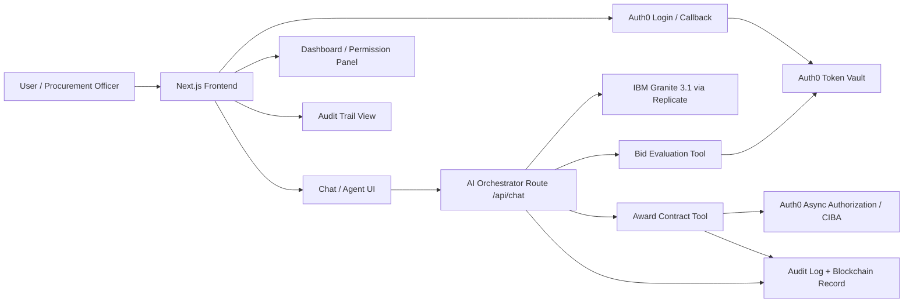
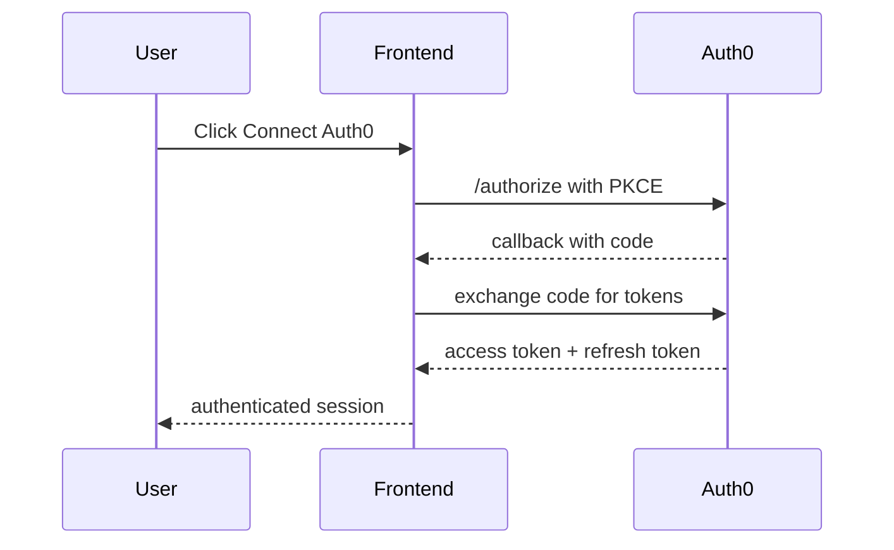
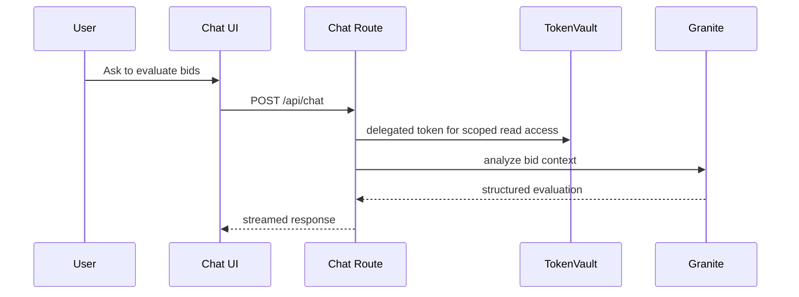
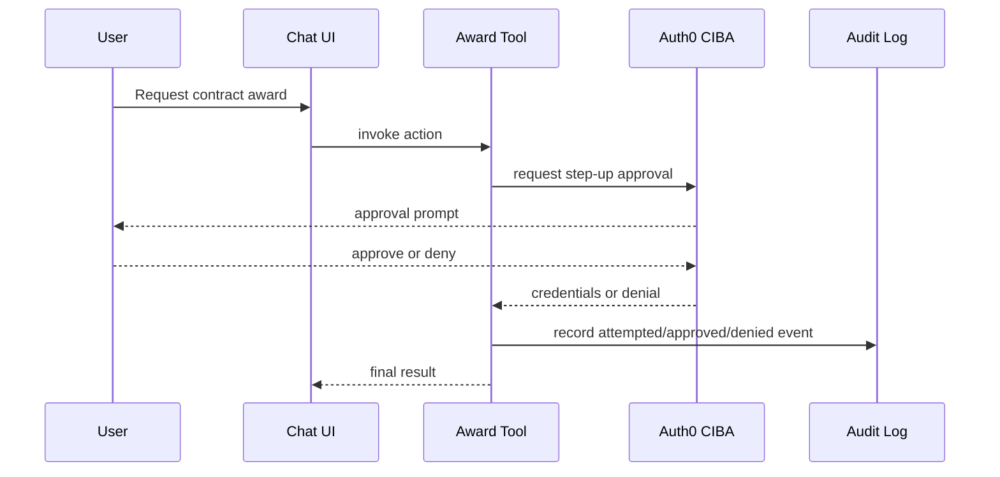

# Auth Ecosystem System Architecture

## Overview

Auth Ecosystem is an agentic procurement platform that combines a Next.js frontend, an AI orchestration layer, Auth0 Token Vault, human-in-the-loop authorization, and immutable audit logging. The system is designed so the agent can evaluate bids and request high-stakes actions without ever operating outside explicit permission boundaries.

## Architecture Diagram

## Main Layers

### 1. Presentation Layer
- **Next.js Frontend**
   - Landing page
   - Dashboard
   - Audit trail page
   - Auth state and chat interaction
- **UI Goals**
   - Show permissions clearly
   - Surface step-up approvals before high-risk actions
   - Present a transparent audit trail

### 2. Identity and Authorization Layer
- **Auth0 Login Flow**
   - Authorization code flow with PKCE
   - Local callback route handles token exchange
- **Token Vault**
   - Supplies delegated access tokens for downstream calls
   - Keeps raw user credentials out of the agent context
- **Async Authorization / CIBA**
   - Required for high-stakes actions like contract awards
   - Human approval is required before execution

### 3. Agent Orchestration Layer
- **Chat Route** (`/api/chat`)
   - Converts user messages into core AI messages
   - Invokes IBM Granite 3.1 through the AI SDK
   - Dispatches bid evaluation and award tools
- **System Prompt Governance**
   - Instructs the agent to call the correct tools
   - Reinforces the requirement for human approval on high-risk actions

### 4. Tooling Layer
- **Bid Evaluation Tool**
   - Uses Token Vault delegated access
   - Reads bid data and returns analysis results
- **Award Contract Tool**
   - Requires step-up authorization
   - Validates and normalizes inputs
   - Emits audit logs for attempted, approved, and denied actions

### 5. Audit and Transparency Layer
- **Permission Dashboard**
   - Shows active scopes and step-up status
- **Approval Modal**
   - Displays risk, scope, and authorization window
- **Audit Trail**
   - Logs award attempts and outputs a user-visible blockchain ledger view

## Request Flow

### Authentication Flow

### Bid Evaluation Flow

### High-Stakes Award Flow

## Security Boundaries

1. **User credentials are not exposed to the agent**.
2. **Token Vault scopes restrict downstream access**.
3. **High-risk actions require step-up approval**.
4. **Failed auth or authorization denies execution by default**.
5. **Audit logs capture the security story for every sensitive action**.

## Why This Architecture Fits the Submission

- It uses **Auth0 Token Vault** as the core requirement.
- It demonstrates **agent authorization patterns**, not just basic login.
- It includes **step-up/CIBA** for human approval on sensitive actions.
- It gives judges a clear explanation of how the agent stays within explicit permission boundaries.

## Key Implementation Points

- Frontend: `frontend/src/app`
- Auth callback: `frontend/src/app/api/auth/[auth0]/route.ts`
- AI chat orchestration: `frontend/src/app/api/chat/route.ts`
- Token Vault and CIBA helpers: `frontend/src/lib/auth0-ai.ts`
- Bid evaluation tool: `frontend/src/lib/tools/evaluate-bids.ts`
- Contract award tool: `frontend/src/lib/tools/award-contract.ts`

## Future Hardening Ideas

- Add token replay protection / sender-constrained tokens where supported.
- Add idempotency keys for award actions.
- Add server-side risk scoring for approval thresholds.
- Add a public verification endpoint for audit integrity checks.
   - Learning from historical procurement decisions

### 2. Blockchain Integration
1. **Smart Contracts**
   - Advanced features
   - Gas optimization
   - Cross-chain support
   - Automated verification

2. **Transaction Management**
   - Batch processing
   - Cost optimization
   - Speed improvements
   - Recovery mechanisms

3. **Explainable Blockchain**
   - User-friendly transaction visualization
   - Plain language explanation of blockchain records
   - Interactive timeline of procurement events
   - Visual representation of document integrity
   - Simplified verification process for non-technical users
   - Educational resources about blockchain immutability
   - Real-time verification status indicators

### 3. Research and Data Integration
1. **Procurement Research**
   - Partnership with academic institutions
   - Analysis of successful procurement patterns
   - Study of evaluation methodologies
   - Research on bias prevention in procurement
   - Development of standardized metrics

2. **Dataset Development**
   - Collection of historical procurement data
   - Curation of bid evaluation examples
   - Documentation of award decisions
   - Compilation of industry-specific requirements
   - Building evaluation criteria database

3. **Knowledge Base Enhancement**
   - Integration of procurement regulations
   - Industry-specific requirements library
   - Best practices documentation
   - Case studies of successful procurements
   - Standardized evaluation frameworks

### 4. User Experience Improvements
1. **Blockchain Visualization**
   - Interactive transaction explorer
   - Document integrity verification interface
   - Timeline-based event tracking
   - Visual proof of immutability
   - Simplified blockchain status indicators

2. **Educational Resources**
   - Blockchain concept explanations
   - Procurement process guides
   - Evaluation criteria documentation
   - Best practices tutorials
   - Interactive learning modules

3. **Transparency Features**
   - Public agent monitoring dashboard
   - Real-time status tracking
   - Automated compliance checking
   - Decision audit trails
   - Stakeholder notification system 